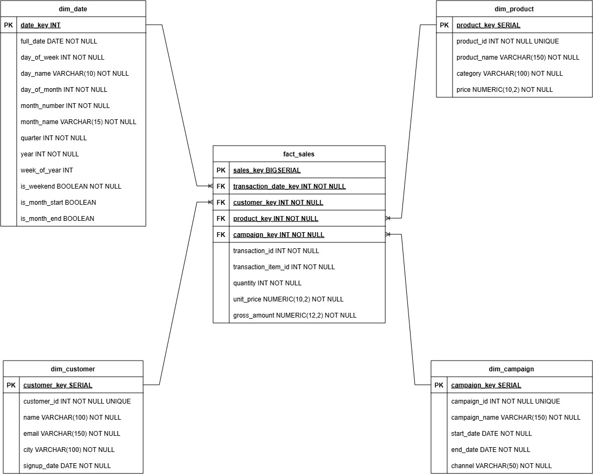

# de-technical-test-2026

## Explanation of Modeling Choices
- Star Schema Selection: Make query simple, fast count, and very easy for BI tools.
- Fact Table Granularity: Set at the transaction line item level to allow granular slice-and-dice operations without losing data.
- Surrogate Keys (_key): Use number key, not source ID. Make join fast, safe from system change, and good for future Slowly Changing Dimensions (SCD).
- Dedicated dim_date: Change SQL date to number index (YYYYMMDD). No slow parsing, make season filter fast.
- Degenerate Dimensions: Keep old source ID inside fact table for easy check back to system.
- Measures Strategy: Save already-calculated and checked numbers. No recalculate at runtime, data always same.
- Fact Partitioning: Split table by transaction_date_key. Big table scan become very fast because auto-drop unneeded part.


## ERD Schema


## Architecture


### Explanation Architecture
#### Stream Pipeline
The stream pipeline handles continuous, real-time data ingestion and initial storage.
- Transaction Generator: Simulates/Generates tranasction data. It fetches details from the customers and products tables to build complete transaction contexts. Simultaneously, it calculates and prints out aggregated transactions per minute directly to the Console Log (Terminal).
- Apache Kafka: Acts as the real-time message broker. The generator publishes raw transactions to the topic stream.transaction.raw.
- Processor: Consumes the messages from Kafka under the consumer group transaction_group. It processes the stream and inserts the records into databases: transactions and transaction_items.

#### ETL Pipeline
The ETL (Extract, Transform, Load) pipeline handles periodic batch processing to move data into the data warehouse.
- Extract: Fetches historical or batched records from all source tables (customers, products, marketing_campaigns, transactions, and transaction_items) and moves them into a temporary Staging Schema.
- Transformation: Reads from the staging schema to clean, structure, and format the data according to data warehouse standards.
- Load & Create Partition: Inserts the processed, structured data into the Data Warehouse (DW).
    - It populates the Dimension Tables (dim_customer, dim_product, dim_date, dim_campaign).
    - It creates specific data partitions before inserting the transactional metrics into the Fact Table (fact_sales) to optimize analytical query speeds.


## How to run

### Prerequisites
this project is run on this environment:
* Python 3.12.3
* Docker version 28.5.1

### 1. Initialization
Before running any components, grant execution permissions to the main runner script:
```bash
chmod +x run.sh
```

### 2. Running the ETL Pipeline
To execute the ETL pipeline, run:
```bash
./run.sh etl
```
* **Airflow Webserver Access:** Open your browser and log in with **Username:** `airflow` | **Password:** `airflow`


## 3. Running the Transaction Stream Data Generator
To start generating stream data and see the aggregate transaction count per minute, run:
```bash
./run.sh stream
```


To view the live stream aggregator, monitor the container logs:
```bash
docker logs -f tx_generator
```
*Expected Log Output:*
```text
2026-08-07 02:17:00 -> 26 transactions
2026-08-07 02:18:00 -> 58 transactions
2026-08-07 02:19:00 -> 58 transactions
2026-08-07 02:20:00 -> 59 transactions
```

### 4. Stopping the Services
To stop and tear down all running services, execute:
```bash
./run.sh down
```

## Infrastructure Access & Debugging

### Database Container
Access the PostgreSQL database container directly via `psql`:
```bash
docker exec -it de_tech_test_db psql -U user -d tech_test_db
```

### Kafka Container
Consume and view live messages from the raw transaction topic:
```bash
docker exec -it de_kafka /opt/kafka/bin/kafka-console-consumer.sh --bootstrap-server localhost:9092 --topic stream.transaction.raw
```