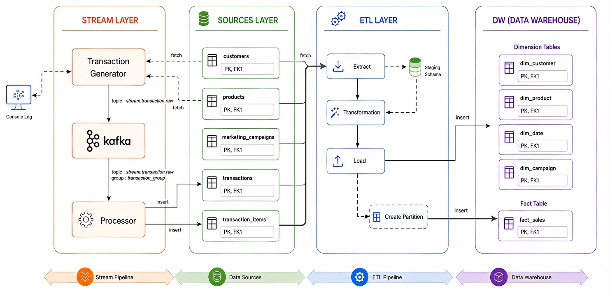

# de-technical-test-2026

<!-- docker exec -it de_tech_test_db psql -U user -d tech_test_db

docker exec -it de_kafka /opt/kafka/bin/kafka-console-consumer.sh --bootstrap-server localhost:9092 --topic stream.transaction.raw

SELECT ti.transaction_item_id, t.transaction_id, ti.product_id, ti.quantity, ti.price, t.total_amount
FROM transactions t
RIGHT JOIN transaction_items ti ON ti.transaction_id = t.transaction_id
LIMIT 4; -->

## Explanation of Modeling Choices
- Star Schema Selection: Simplifies analytical queries, delivers faster aggregations, and provides a business-friendly structure for BI tools.
- Fact Table Granularity: Set at the transaction line item level to allow granular slice-and-dice operations without losing data.
- Surrogate Keys (_key): Used instead of operational IDs to speed up joins via integer formats, decouple the warehouse from source changes, and support future Slowly Changing Dimensions (SCD).
- Dedicated dim_date: Replaces raw SQL date functions with an integer index (YYYYMMDD) to eliminate slow runtime parsing and accelerate seasonal filtering.
- Degenerate Dimensions: Retains operational IDs in the fact table to ensure complete data auditability back to the source system.
- Measures Strategy: Stores pre-computed, CHECK-validated metrics to eliminate runtime recalculations and enforce data consistency.
- Campaign Handling: Uses a default "No Campaign" row to avoid NULL joins and simplify query logic.
- Fact Partitioning: Partitioned by transaction_date_key to accelerate scans on large tables through automatic partition pruning.

## Architecture

<!-- 1. DAG Trigger (Daily)
- Runs once per day
- Starts from start_date = 2025-01-01

2. Task 1: Extract (extract_to_staging)
- Connect to Postgres
- Stored into staging tables:
    stag_customers
    stag_products
    stag_transactions
    stag_transaction_items
    stag_marketing_campaigns
    Extract data from source tables

3. Task 2: Transform & Load (transform_and_load_dw)

A. Read Staging Data
- Load all staging tables into pandas DataFrames
B. Transform
- Clean + validate:
- Transactions (dates, amounts, duplicates)
- Customers (email, city, signup date)
- Products (price, category)
- Campaigns (date logic)
- Create dimensions:
    dim_customer
    dim_product
    dim_campaign
    dim_date
C. Load Dimensions
- Upsert into:
    dim_customer
    dim_product
    dim_campaign
    dim_date
D. Build Fact Table (fact_sales)
- Join:
    transactions + items + dimensions
- Calculate metrics:
    gross, net, tax, total
    cost, profit
    item_count, avg_item_price
- Remove duplicates (existing records check)
E. Partition Handling
- Create monthly partitions:
    fact_sales_YYYY_MM
F. Load Fact
Insert into fact_sales -->